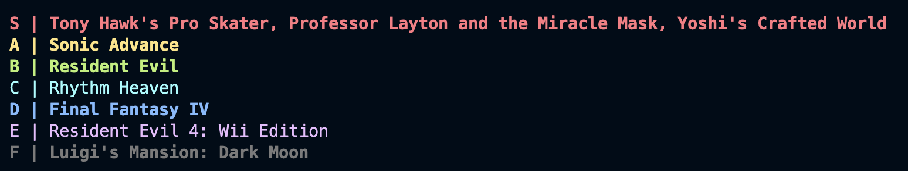

# Tiers of the Kingdom
By Madeline Shao

Tiers of the Kingdom is a tier list maker that uses an SQL database and a command line app.
Users can register and login to an account, create/edit/delete tierlists for Nintendo video games, and view
other users' tierlists, game statistics, etc.

Data sourced from https://www.kaggle.com/datasets/codefantasy/list-of-best-selling-nintendo-games.

## Loading data
To load data, launch MySQL in the tiers-of-the-kingdom directory. Then run the following in MySQL:
```
CREATE DATABASE tierlistdb;
USE tierlistdb;
source setup.sql;
source load-data.sql;
source setup-passwords.sql;
source setup-routines.sql;
source grant-permissions.sql;
```

## Running the app
Install the Python MySQL Connector using pip3 if not installed already.
To run the command line app, run the following in the terminal:
`python3 app.py`

## Logging in
For testing purposes, you can login as the following users:

### Client accounts
Client login information:
username: `princess_zelda`\
password: `triforce`

OR

username: `link`\
password: `mastersword`

OR

Create your own account!

### Admin accounts
Admin login information:

username: `testuser`\
password: `testpw`

## Suggestions
Guides on how to get started:

### As a guest user (not logged in)
1. Choose option (u) to see the list of tierlists you can view. Remember the name of the tierlist you want to view and the user who owns the tierlist.
2. Choose option (v) to view the tierlist by inputting the username and the tierlist name.
3. Choose option (l) to log in or create an account.

### As a client
1. Choose option (g) to view the list of Nintendo games you can tier. Allows for filtering and sorting. Remember the IDs of the video games you want to tier.
2. Choose option (t) to see the the different tiers. Remember the IDs of the tiers you want to use.
3. Choose option (c) to create a tierlist.
2. Choose option (e) to edit the tierlist, and assign to games to tiers.

### As an admin
1. Choose option (a) to add a video game to the database.
2. Choose option (m) to update the sales number of a game.
3. Choose option (a) to add a new tier.

## Example tierlist

